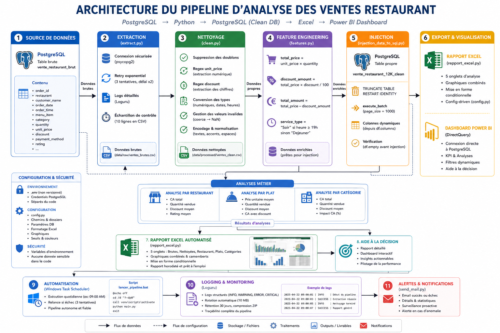
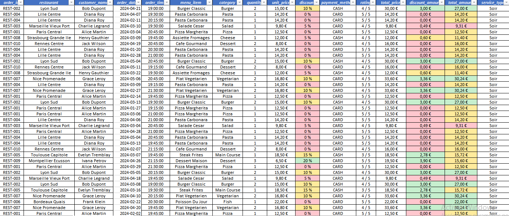
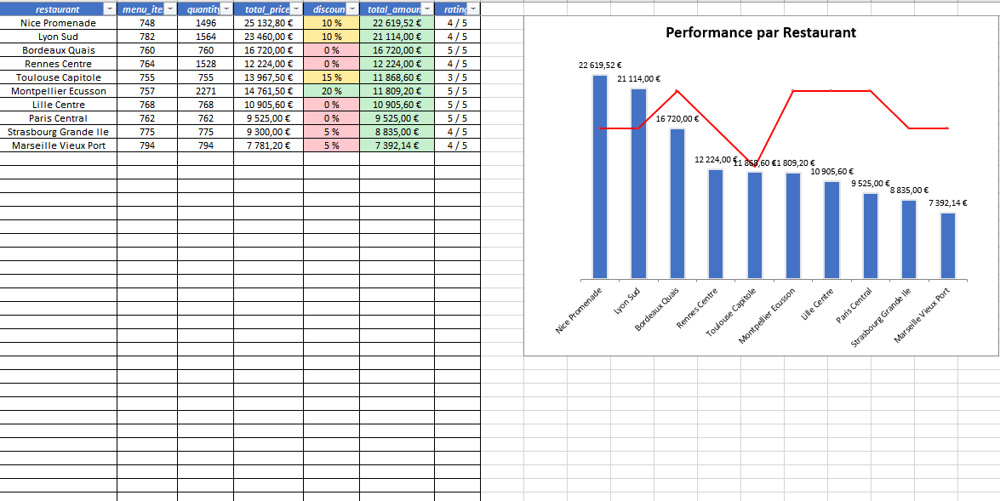
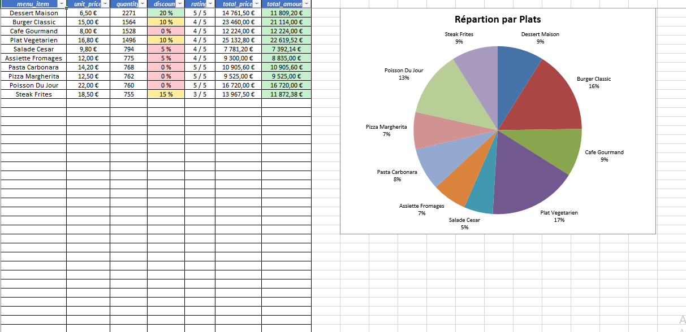
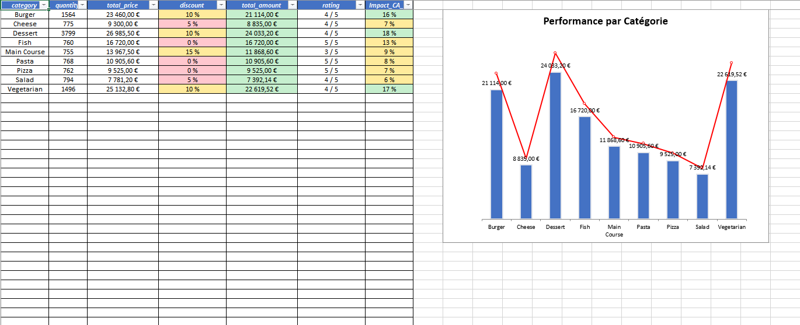
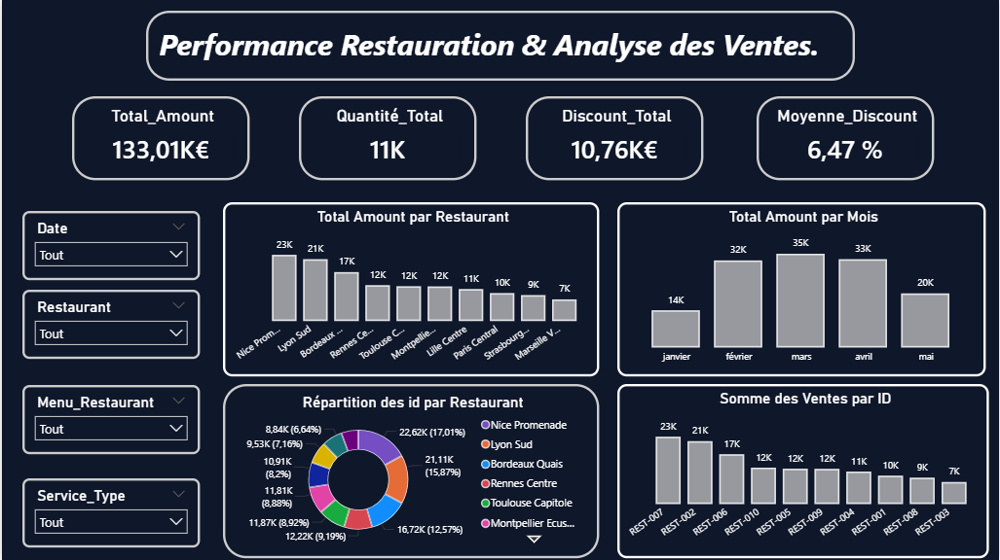

# 🍽️ Pipeline ETL — Analyse des Ventes Restaurant


Pipeline ETL complet et automatisé pour l'analyse des ventes d'un réseau de **10 restaurants français**.  
Les données brutes sont extraites depuis PostgreSQL, nettoyées, enrichies, réinjectées en base propre, puis restituées via un **rapport Excel multi-onglets avec graphiques** et un **dashboard Power BI** connecté directement à la base de données.

---

## 📐 Architecture du Pipeline



---

## 📊 Résultats — Aperçu des KPIs

| Indicateur | Valeur |
|---|---|
| Lignes brutes | 12 000 |
| Doublons supprimés | 4 335 (36%) |
| Lignes traitées et injectées | 7 665 |
| Chiffre d'affaires total | 133 010 € |
| Quantité vendue | 11 000+ unités |
| Remise moyenne | 6,47 % |
| Restaurants analysés | 10 |
| Plats au menu | 10 |
| Temps d'exécution pipeline | ~6,7 secondes |

---

## 📁 Structure du Projet

```
Structuration_projet_vente-restaurant/
│
├── src/
│   ├── __init__.py
│   ├── extract.py                  # Extraction PostgreSQL avec retry exponentiel
│   ├── clean.py                    # Nettoyage robuste (regex, types stricts, doublons)
│   ├── features.py                 # Feature engineering (total_price, discount_amount, service_type)
│   ├── injection_data_to_sql.py    # Injection PostgreSQL (TRUNCATE + execute_batch)
│   ├── analysis_restaurant.py      # Analyse agrégée par restaurant
│   ├── analysis_plats.py           # Analyse agrégée par plat
│   ├── analysis_category.py        # Analyse agrégée par catégorie + Impact CA%
│   ├── repport_excel.py            # Rapport Excel config-driven (graphiques + formatage)
│   ├── logging.py                  # Configuration Loguru centralisée
│   └── notifications.py            # Notifications email (succès / échec)
│
├── tests/
│   ├── conftest.py                 # Fixture partagée (sample_df)
│   ├── test_clean_data.py          # Tests unitaires clean.py
│   └── test_add_features.py        # Tests unitaires features.py
│
├── data/
│   ├── raw/                        # Échantillon CSV brut (10 lignes — contrôle)
│   └── processed/                  # Échantillon CSV nettoyé (10 lignes — contrôle)
│
├── images/
│   ├── Diagramme_Architecture/     # Diagramme complet du pipeline
│   ├── Dashbord_Power_BI/          # Captures du dashboard Power BI
│   └── Rapport_Excel/              # Captures du rapport Excel généré
│
├── Output/                         # Rapport Excel horodaté (vente_restaurant_DD-MM-YYYY_HH-MM.xlsx)
├── Logs/                           # Fichiers de logs (rotation 10 MB, rétention 30 jours)
├── power_bi/                       # Fichier dashboard Power BI (.pbix)
├── reports/                        # Rapport d'analyse PDF
│
├── config.py                       # Configuration centralisée (chemins, DB, Excel, graphiques, SMTP)
├── main.py                         # Point d'entrée du pipeline
├── shema.sql                       # Script SQL de création des tables
├── run_pipeline.bat                 # Lancement automatisé Windows
├── requirements.txt                 # Dépendances Python
├── .env                            # Credentials (non versionné)
├── .env.exemple                    # Template credentials
└── .gitignore
└── .gitattributes              # Gestion des fins de ligne et fichiers binaires
```

---

## ⚙️ Configuration Centralisée — `config.py`

Toute la configuration du projet est centralisée dans `config.py` :

- **Connexion PostgreSQL** via `dotenv_values(".env")` — aucun credential exposé dans le code
- **Chemins** gérés via `pathlib.Path` avec création automatique des dossiers
- **Notifications SMTP** — serveur, port, expéditeur, destinataire externalisés dans `.env`
- **`EXCEL_FORMATTING`** — dictionnaire de dictionnaires `(feuille → colonne → seuils)` pour la mise en forme conditionnelle
- **`EXCEL_CHARTS`** — configuration complète des graphiques `(type, séries, couleurs, data labels, markers)`
- **`EXCLUDED_SHEETS`** — feuilles exclues du formatage automatique
- **`TIMEOUT_SMTP = 30`** — timeout de connexion SMTP pour éviter tout blocage
- **`FILE_PATH_REPORT`** — chemin vers le rapport PDF joint automatiquement à l'email
- **`.gitattributes`** — force LF sur les .py, CRLF sur les .bat, et marque les fichiers binaires (pdf, xlsx, db) comme intacts pour Git

```python
# Exemple — architecture config-driven
EXCEL_FORMATTING = {
    'Données Par Restaurant': {
        'total_amount': {'red_value': 15, 'min_orange': 15, 'max_orange': 40, 'green_value': 40},
        'discount':     {'red_value': 5,  'min_orange': 6,  'max_orange': 15, 'green_value': 15}
    },
    ...
}
```

---

## 🔧 Modules Détaillés

### `extract.py` — Extraction
- Connexion PostgreSQL sécurisée via `psycopg2`
- **Retry exponentiel** : 3 tentatives, délai x2 à chaque échec
- Sauvegarde d'un échantillon de contrôle (10 lignes) en CSV local
- `sys.exit()` si toutes les tentatives échouent

### `clean.py` — Nettoyage
- Suppression des doublons avec log dynamique du nombre supprimé
- **Regex optimisée** sur `unit_price` : `r"(\d+[\,.]?\d*)"` — extrait la partie numérique et gère les bugs d'encodage (`€` → `â¬`)
- **Regex optimisée** sur `discount` : `r"(\d+)"` — extrait les chiffres, ignore `%`
- `pd.to_numeric(errors='coerce')` sur toutes les colonnes numériques — zéro plantage sur valeurs invalides
- `downcast='integer'` sur `quantity` pour économie mémoire
- Dates : `format='mixed'` + `dayfirst=True` pour formats européens mixtes
- Heures : `format='mixed'` pour `HH:MM` et `HH:MM:SS`
- Export d'un échantillon de 10 lignes pour contrôle qualité

### `features.py` — Enrichissement

| Colonne créée | Calcul |
|---|---|
| `total_price` | `unit_price × quantity` |
| `discount_amount` | `total_price × discount / 100` |
| `total_amount` | `total_price − discount_amount` |
| `service_type` | `"Soir"` si heure ≥ 19h, sinon `"Dejeuner"` |

### `injection_data_to_sql.py` — Injection PostgreSQL
- Vérification `df.empty` avant toute injection
- `TRUNCATE TABLE ... RESTART IDENTITY` — remet le compteur `SERIAL` à 1
- `execute_batch(cur, query, data, page_size=1000)` — injection par lots de 1 000 lignes
- Colonnes dynamiques depuis `df.columns` — aucun `id` hardcodé

### `analysis_*.py` — 3 Axes d'Analyse
- **Par restaurant** : CA total, quantité, remise moyenne, note moyenne — trié par `total_amount` DESC
- **Par plat** : prix unitaire, quantité, remise moyenne, note, CA avec remise appliquée
- **Par catégorie** : agrégats + `Impact_CA_%` = part de chaque catégorie dans le CA total

### `repport_excel.py` — Rapport Excel Config-Driven
- Architecture **config-driven** : toute la logique de formatage et de graphiques est dans `config.py`
- En-têtes colorés, freeze panes, autofiltre sur toutes les feuilles traitées
- Ajustement automatique de la largeur des colonnes
- Formats monétaires (`#,##0.00 €`), pourcentages, notes (`0" / 5"`)
- Mise en forme conditionnelle (🔴 rouge / 🟠 orange / 🟢 vert) par feuille et par colonne
- **Graphiques combinés** colonne + ligne avec axe Y secondaire pour le rating
- Camembert pour la répartition par plat
- Détection automatique du type de série via `serie.get('type') == 'line'`

### `notifications.py` — Alertes Email
- Email automatique après chaque exécution — ✅ succès ou ❌ échec
- Corps du mail dynamique avec les métriques clés (lignes traitées, durée, fichier généré)
- **Pièce jointe automatique** : le rapport PDF est joint à l'email en cas de succès
- Vérification défensive `path.exists() and path.is_file()` avant attachement
- `timeout=TIMEOUT_SMTP` — évite tout blocage infini sur le serveur SMTP
- Connexion SMTP sécurisée via `starttls()`
- Credentials et chemins entièrement externalisés dans `.env` et `config.py`

---

## 📈 Rapport Excel Généré

### Vue d'ensemble — Données aux Complets


### Analyse par Restaurant


### Analyse par Plat


### Analyse par Catégorie


---

## 📊 Dashboard Power BI

Connexion directe à PostgreSQL via le pilote **Npgsql v4.1.3** (GAC Installation) — aucun export CSV intermédiaire.



| Visuel | Description |
|---|---|
| 4 Cartes KPI | CA Total · Quantité · Remise Totale · Remise Moyenne |
| Barres par restaurant | CA par restaurant avec tri automatique |
| Barres par mois | Évolution mensuelle du CA (janvier → mai 2024) |
| Camembert par restaurant | Répartition du CA en % par restaurant |
| Filtres dynamiques | Date · Restaurant · Menu · Type de service |

> 💡 **Le dashboard Power BI permettra au Directeur de suivre l'évolution de Toulouse Capitole et du Steak Frites suite aux actions correctives identifiées dans le rapport d'analyse.**

---

## 🧪 Tests Unitaires

```bash
pytest tests/ -v
```

| Fichier | Fonction testée | Assertions |
|---|---|---|
| `test_clean_data.py` | `cleaning_data()` | Types, valeurs, formats date/heure |
| `test_add_features.py` | `add_features()` | Calculs financiers, service_type |

---

## 🤖 Automatisation

Le pipeline s'exécute automatiquement via le **Planificateur de tâches Windows** :

```bat
@echo off
cd /d "%~dp0"
call venv\scripts\activate
python main.py
exit
```

- Exécution quotidienne programmée (ex : 09h00)
- Relance automatique en cas d'échec (3 tentatives)
- Notification email à chaque exécution

---

## 🚀 Installation & Lancement

### Prérequis
- Python 3.11+
- PostgreSQL 15+
- Power BI Desktop (optionnel)

### Installation

```bash
git clone https://github.com/SopeTaha92/Structuration-Projet-ventes_janvier
cd Structuration-Projet-ventes_janvier
pip install -r requirements.txt
```

### Configuration

```bash
cp .env.exemple .env
# Éditer .env avec vos credentials
```

```env
# Base de données
DB_HOST=localhost
DB_PORT=5432
DB_NAME=votre_base
DB_USER=postgres
DB_PASSWORD=votre_mot_de_passe
DB_TABLE=vente_restaurant_12K_brute
DB_TABLE_COMPLET=vente_restaurant_12K_clean

# Notifications email
SERVER=smtp.gmail.com
PORT=587
FROM=votre_email@gmail.com
TO=destinataire@gmail.com
PASSWORD=votre_mot_de_passe_application
TIMEOUT_SMTP=30
```

### Initialisation de la base de données

```bash
psql -U postgres -d votre_base -f shema.sql
```

### Lancement

```bash
# Lancement manuel
python main.py

# Lancement via script Windows
run_pipeline.bat
```

Le rapport Excel est généré automatiquement dans `Output/vente_restaurant_DD-MM-YYYY_HH-MM.xlsx`.

---

## 📦 Dépendances

```
pandas==3.0.1
psycopg2-binary==2.9.12
python-dotenv==1.2.2
loguru==0.7.3
xlsxwriter==3.2.9
pytest==9.0.3
colorama==0.4.6
numpy==2.4.3
```

---

## ⚠️ Limitations

> Les données utilisées sont **synthétiques et générées par IA**.  
> 4 335 doublons ont été détectés et supprimés sur 12 000 lignes initiales (36%).  
> Certains `unit_price` peuvent valoir 0 — artefact de la génération IA. Les contraintes SQL ont été adaptées en conséquence (`>= 0` au lieu de `> 0`).

---

## 👤 Auteur

**Mahmoud At-Tidiane**  
Analyste de Données · Ingénieur de Données · Ingénieur Analytique  
📍 Dakar, Sénégal  
🔗 [github.com/SopeTaha92](https://github.com/SopeTaha92)
